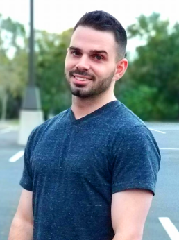

# About Us

Welcome to [Veteran Security](https://www.facebook.com/VetSec-2337490683199858/)! Founded by Ryan Edmondson and Heath Adams in February of 2018, we are a non profit consisting of an ever-growing veteran community that focuses on networking with other veterans in the IT and Cyber Security world as well as helping those that are currently transitioning out of the military and looking into these career fields. Our community is open to active serving and military veterans of any country. Currently, we offer:

* A Slack channel with over 1,000 members, which allows veterans in any IT or cyber security field to network with each other.
* Free training videos, focused on ethical hacking.
* A Cyber Security blog with tutorials on a wide variety of topics.

Our community, training, and services are, and always will be, 100% free.
If you would like to make a contribution to our cause, we have set up a [patreon](https://www.patreon.com/vetsec) just for that! Thank you for your support!

---

# Who We Are

    <b>Elliot “Emtuls” Chernofsky</b>    

Hey all. I’m Elliot Chernofsky and I go by ‘Emtuls’ in most places online. I have a Bachelors in Electrical Engineering and am currently working on my Masters in Computer Science. Although I am not a big fan of certifications, I do have my fair share of them.

For my military career, I have served and am still currently serving in the Air National Guard as a prior 3D1X1 (Combat Comms/Networking), and now 17S (Cyber Warfare Officer) doing cyber stuff.

I stumbled upon my passion of Cyber Security while in my senior year of Undergrad and have since begun working full time in Vulnerability Research, doing a mix of Tool Development and Reverse Engineering.

My passion lies in the realm of programming, reverse engineering and exploit development and I seek to help others get into this growing field as I continue to expand my knowledge and get a deeper understanding of them.

---

#### Heather “infosecanon” Lawrence | [Github](https://github.com/infosecanon) | [LinkedIn](https://www.linkedin.com/in/hlawrence2010/) | [@infosecanon](https://twitter.com/infosecanon)

Heather Lawrence is a data scientist for the Nebraska Applied Research Institute who earned her undergraduate and masters degrees in Computer Engineering from the University of Central Florida.

In previous lives she was a USN nuke, VA photographer, NCCDC winner, Hack@UCF mom, and darknet marketplace miner. Her current research centers on the application of machine learning to intrusion detection.

She serves the community through volunteer work for Kernelcon and DEF CON as well as facilitating logistics as a member of the VetSec and B-Sides Orlando boards.

---

#### Scott “h4zegrey” Farber | [Github](https://twitter.com/h4zegrey) | [LinkedIn](https://www.linkedin.com/in/scottfarber/) | [@h4zegrey](https://twitter.com/h4zegrey)

Former US Navy Electronics Technician, specializing in Link 11 (AN/USQ-74), and URT-23 HF gear. I served on the USS Mahan DDG-42 during Desert Storm.

I have been in various IT fields since 1995, starting off doing helpdesk and PC support, networking, and now security. I started in DoD contracting, made the rounds of UUNet, InterNAP, AOL, Adelphia Cable, and Nextel. From there I moved to an eCommerce and MVNO company where I started getting my hands dirty on firewalls and PCI compliance. I then ran the network as an engineering manager at Customs & Border Protection before eventually moving to MITRE where I now manage Infrastructure Security Engineering for our corporate IT systems.

During my service on the board, I’m looking forward to growing the organization and helping to build partnerships that will help jumpstart and sustain our members’ careers.

---

#### Chad “danger__rat” Boyd | [Github](https://github.com/cboyd0319) | [LinkedIn](https://www.linkedin.com/in/chadboyd/) | [@danger__rat](https://twitter.com/danger__rat)

Former Army 74B (25B) and Navy Reserve IT.

I’ve been a systems admin/engineer for around 20 years, and am currently a Sr. Security Engineer, focusing on containers and Kubernetes.

While serving on the board, it’s my goal to continue to grow VetSec, and work to provide training and job opportunities for our members.

---

#### Jake "j2k3k" Knowlton | [Github](https://github.com/j2k3k) | [LinkedIn](https://www.linkedin.com/in/jacobknowlton/) | [@j2k3k](https://twitter.com/j2k3k)

Former USAF Airborne Systems Engineer (1A3) that flew on the RC/OC-135 ISR platforms.

I have had a lifelong curiosity in information security, with the past ten years in various IT or technical roles. I am currently an Information Security Analyst.

VetSec was critical to my transition from an active duty career into the civilian career I desired. The mentorship, career guidance, and companionship from people who get it put me on the path for success right away. Now, it’s my turn to give back. The growth of VetSec is my primary concern, and along with helping the board mold the organization into a place where Vets can feel at home.

